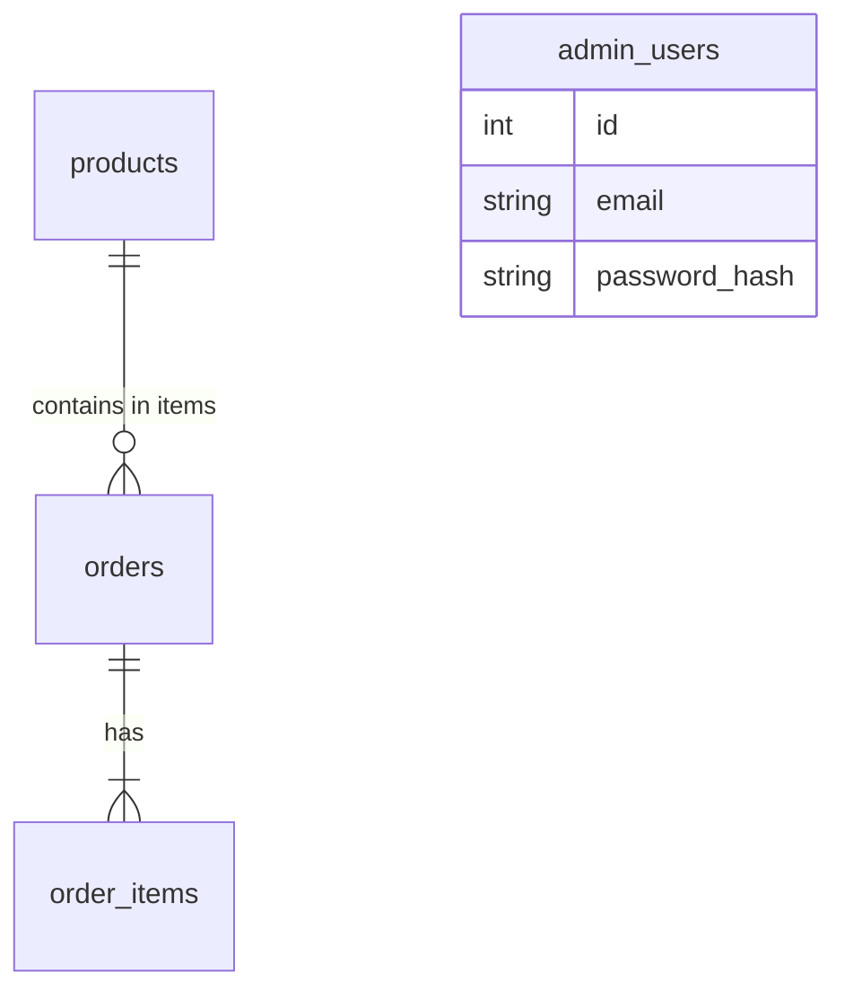

# 07 - Database Architecture

## ER Diagram

```mermaid
erDiagram
    products ||--o{ orders : "contains in items"
    orders ||--|{ order_items : "has"
    admin_users {
        int id
        string email
        string password_hash
    }
```

Tables:
- `products`: Catalog items.
- `admin_users`: Administrator credentials.
- `orders`: E-commerce orders.
