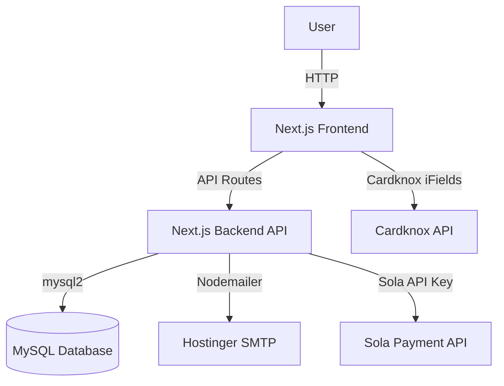

# System Architecture

> Purpose: System architecture diagram and request flows.

## Architecture

The application uses Next.js as a full-stack framework. The App Router handles both SSR/SSG pages and API routes (`src/app/api`).
